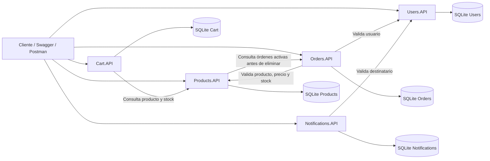

[README.md](https://github.com/user-attachments/files/28901895/README.md)
# E-Commerce con Arquitectura de Microservicios

Solución académica de e-commerce desarrollada con **C#**, **ASP.NET Core 8** y una arquitectura basada en microservicios. El sistema separa las responsabilidades de productos, usuarios, órdenes, carritos y notificaciones en APIs REST independientes, cada una con su propia lógica de negocio, persistencia, documentación y mecanismos de observabilidad.

La solución incluye:

- Cinco microservicios REST independientes.
- Persistencia por servicio mediante SQLite y Dapper.
- Comunicación HTTP entre microservicios con `IHttpClientFactory`.
- Manejo global de errores con `IExceptionHandler` y `ProblemDetails`.
- Catálogos de errores propios por dominio.
- Documentación interactiva con Swagger/OpenAPI.
- Logging estructurado con Serilog.
- Correlation ID por request y propagación entre servicios.
- Health checks de disponibilidad, preparación y dependencias.

---

## 1. Arquitectura general

La solución está compuesta por los siguientes microservicios:

| Microservicio | Responsabilidad principal |
|---|---|
| **Products.API** | Alta, consulta, modificación y eliminación de productos. Control de duplicados, stock y validación de órdenes activas. |
| **Users.API** | Registro y autenticación de usuarios. Control de credenciales, intentos fallidos y bloqueo de cuentas. |
| **Orders.API** | Creación y consulta de órdenes. Validación de usuarios, productos, stock, total y transiciones de estado. |
| **Cart.API** | Administración del carrito de compras de cada usuario. Validación de productos, cantidades y stock. |
| **Notifications.API** | Registro y simulación de envío de notificaciones por Email, Push o SMS. |

Cada microservicio mantiene su propio modelo, reglas, base de datos y contrato de errores. La comunicación entre servicios se realiza mediante HTTP.

### Diagrama de arquitectura



> La dependencia entre `Products.API` y `Orders.API` se utiliza cuando se intenta eliminar un producto. El producto no puede eliminarse si posee órdenes activas en estado `Pendiente` o `Confirmada`.

---

## 2. Tecnologías utilizadas

| Propósito | Tecnología o paquete |
|---|---|
| Framework | .NET 8 / ASP.NET Core Web API |
| Lenguaje | C# |
| Persistencia | SQLite |
| Acceso a datos | Dapper |
| Documentación | Swagger / OpenAPI / Swashbuckle |
| Manejo de errores | `IExceptionHandler` + `ProblemDetails` |
| Logging | Serilog |
| Logs en consola | Serilog.Sinks.Console |
| Logs en archivos | Serilog.Sinks.File |
| Validación | Data Annotations y validaciones de negocio |
| Comunicación HTTP | `IHttpClientFactory` |
| Monitoreo | ASP.NET Core Health Checks |
| Interfaz de Health Checks | HealthChecks UI, cuando está habilitada |

Las versiones concretas de los paquetes pueden consultarse en los archivos `.csproj` de cada proyecto.

---

## 3. Estructura de la solución

La estructura esperada del repositorio es la siguiente:

```text
ECommerce.sln
├── src/
│   ├── Products.API/
│   ├── Users.API/
│   ├── Orders.API/
│   ├── Cart.API/
│   └── Notifications.API/
├── docs/
└── README.md
```

Cada microservicio sigue una separación por responsabilidades similar a esta:

```text
Products.API/
├── Controllers/          # Endpoints HTTP
├── Models/               # Entidades del dominio
├── Dtos/                 # Request y response DTOs
├── Services/             # Reglas y lógica de negocio
├── Repositories/         # Acceso a SQLite mediante Dapper
├── Exceptions/           # Excepciones de dominio
├── ExceptionHandlers/    # Implementaciones de IExceptionHandler
├── HealthChecks/         # Verificaciones de estado y dependencias
├── Extensions/           # Registro de servicios y pipeline
├── Properties/
│   └── launchSettings.json
├── logs/                 # Archivos generados por Serilog
├── appsettings.json
├── appsettings.Development.json
└── Program.cs
```

La ubicación exacta de algunos directorios puede variar entre proyectos, pero la solución conserva la separación entre API, lógica de negocio, persistencia y componentes transversales.

---

## 4. Requisitos previos

Para ejecutar la solución es necesario contar con:

- [.NET SDK 8](https://dotnet.microsoft.com/download/dotnet/8.0)
- Visual Studio 2022, Visual Studio Code o Rider
- Git
- Un navegador web para Swagger y Health Checks UI

SQLite no requiere instalar un servidor. Cada microservicio crea o utiliza su propio archivo `.db` según la cadena de conexión configurada.

Para comprobar la versión instalada:

```bash
dotnet --version
```

---

## 5. Clonar, restaurar y compilar

```bash
git clone <URL_DEL_REPOSITORIO>
cd <CARPETA_DEL_REPOSITORIO>
dotnet restore
dotnet build
```

Para listar los proyectos incluidos en la solución:

```bash
dotnet sln list
```

Si la compilación finaliza correctamente, la solución está preparada para ejecutarse.

---

## 6. Configuración

Cada microservicio posee sus propios archivos `appsettings.json` y, cuando corresponde, `appsettings.Development.json`.

### 6.1 Cadena de conexión

Ejemplo:

```json
{
  "ConnectionStrings": {
    "DefaultConnection": "Data Source=products.db"
  }
}
```

Cada servicio utiliza su propia base de datos. Algunos nombres habituales son:

```text
products.db
users.db
orders.db
cart.db
notifications.db
```

El nombre definitivo se toma de la configuración de cada proyecto.

### 6.2 Servicios externos

Los servicios que consumen otras APIs deben configurar las URLs base correspondientes.

Ejemplo:

```json
{
  "ExternalServices": {
    "UsersApi": {
      "BaseUrl": "https://localhost:<PUERTO_USERS>"
    },
    "ProductsApi": {
      "BaseUrl": "https://localhost:<PUERTO_PRODUCTS>"
    },
    "OrdersApi": {
      "BaseUrl": "https://localhost:<PUERTO_ORDERS>"
    }
  }
}
```

Las URLs deben coincidir con los perfiles definidos en:

```text
Properties/launchSettings.json
```

Antes de probar una operación entre microservicios, se debe verificar que la API destino esté iniciada y que la URL configurada sea correcta.

### 6.3 Detalle de errores por entorno

El nivel de detalle de las excepciones se controla por configuración y ambiente.

Ejemplo de desarrollo:

```json
{
  "ErrorHandling": {
    "IncludeExceptionDetails": true
  }
}
```

En producción debe utilizarse `false` para evitar exponer información interna o stack traces.

---

## 7. Ejecución

Para probar todas las funcionalidades se recomienda iniciar los cinco microservicios en terminales separadas.

Ejemplo usando la estructura `src/`:

```bash
dotnet run --project src/Users.API/Users.API.csproj
```

```bash
dotnet run --project src/Products.API/Products.API.csproj
```

```bash
dotnet run --project src/Orders.API/Orders.API.csproj
```

```bash
dotnet run --project src/Cart.API/Cart.API.csproj
```

```bash
dotnet run --project src/Notifications.API/Notifications.API.csproj
```

Si los proyectos se encuentran en la raíz del repositorio, se debe utilizar la ruta real mostrada por `dotnet sln list`.

### Orden recomendado de inicio

1. `Users.API`
2. `Products.API`
3. `Orders.API`
4. `Cart.API`
5. `Notifications.API`

Para ejecutar el flujo completo deben permanecer activos todos los servicios. `Products.API` también puede requerir que `Orders.API` esté disponible al intentar eliminar un producto.

---

## 8. Swagger / OpenAPI

Cada microservicio expone documentación interactiva en:

```text
https://localhost:<PUERTO>/swagger
```

El documento OpenAPI suele encontrarse en:

```text
https://localhost:<PUERTO>/swagger/v1/swagger.json
```

Desde Swagger es posible:

- Consultar todos los endpoints.
- Revisar parámetros, bodies y DTOs.
- Ejecutar requests.
- Ver códigos HTTP posibles.
- Ver ejemplos de respuestas exitosas y de error.
- Probar las reglas de negocio de cada microservicio.

Swagger se encuentra normalmente habilitado en el entorno `Development`.

---

## 9. Endpoints por microservicio

### 9.1 Products.API

| Método | Endpoint | Descripción | Respuestas principales |
|---|---|---|---|
| GET | `/api/products` | Lista productos. Admite filtros `categoria` y `nombre`. | 200, 500 |
| GET | `/api/products/{id}` | Obtiene un producto por ID. | 200, 404, 500 |
| POST | `/api/products` | Crea un producto. | 201, 400, 409, 500 |
| PUT | `/api/products/{id}` | Actualiza un producto existente. | 200, 400, 404, 500 |
| DELETE | `/api/products/{id}` | Elimina un producto si no posee órdenes activas. | 204, 404, 409, 500 |

#### Reglas principales

- El nombre es obligatorio y posee una longitud máxima.
- El precio debe ser mayor que cero.
- El stock debe ser mayor o igual que cero.
- No puede existir otro producto con el mismo nombre dentro de la misma categoría.
- Un producto con órdenes activas no puede eliminarse.
- Las categorías son informativas y no requieren validarse contra una lista cerrada.

---

### 9.2 Users.API

| Método | Endpoint | Descripción | Respuestas principales |
|---|---|---|---|
| POST | `/api/users/register` | Registra un usuario. | 201, 400, 409, 500 |
| POST | `/api/users/login` | Autentica mediante email y contraseña. | 200, 400, 401, 403, 500 |

#### Reglas principales

- El email debe ser válido y único.
- La contraseña nunca se almacena ni se devuelve en texto plano.
- `PasswordHash` nunca se incluye en las respuestas.
- Cada login incorrecto incrementa `IntentosFallidos`.
- Al alcanzar tres intentos fallidos consecutivos, el usuario queda bloqueado.
- Un login correcto reinicia el contador de intentos fallidos.
- También puede existir un bloqueo manual por detección de fraude.

---

### 9.3 Orders.API

| Método | Endpoint | Descripción | Respuestas principales |
|---|---|---|---|
| GET | `/api/orders` | Lista órdenes. Admite filtro `usuarioId`. | 200, 500 |
| GET | `/api/orders/{id}` | Obtiene el detalle de una orden. | 200, 404, 500 |
| POST | `/api/orders` | Crea una nueva orden. | 201, 400, 404, 409, 422, 500 |
| PUT | `/api/orders/{id}/status` | Actualiza el estado de una orden. | 200, 400, 404, 409, 500 |

#### Reglas principales

- La orden debe contener al menos un ítem.
- Cada cantidad debe ser mayor que cero.
- El usuario se valida contra `Users.API`.
- Cada producto se valida contra `Products.API`.
- La cantidad solicitada no puede superar el stock disponible.
- El precio unitario se captura desde el producto al crear la orden.
- El total se calcula automáticamente.
- Las transiciones de estado deben respetar el flujo permitido.

Estados contemplados:

```text
Pendiente
Confirmada
Enviada
Entregada
Cancelada
```

Una orden finalizada no debe volver a un estado previo incompatible.

---

### 9.4 Cart.API

| Método | Endpoint | Descripción | Respuestas principales |
|---|---|---|---|
| GET | `/api/cart/{userId}` | Obtiene el carrito de un usuario. | 200, 404, 500 |
| POST | `/api/cart/{userId}/items` | Agrega un producto al carrito. | 200, 400, 404, 422, 500 |
| PUT | `/api/cart/{userId}/items/{productId}` | Actualiza la cantidad de un ítem. | 200, 400, 404, 422, 500 |
| DELETE | `/api/cart/{userId}/items/{productId}` | Quita un producto del carrito. | 204, 404, 500 |
| DELETE | `/api/cart/{userId}` | Vacía el carrito completo. | 204, 404, 500 |

#### Reglas principales

- La cantidad debe ser mayor que cero.
- El producto debe existir en `Products.API`.
- La cantidad total solicitada no puede superar el stock disponible.
- La fecha de actualización se modifica automáticamente en cada operación.

---

### 9.5 Notifications.API

| Método | Endpoint | Descripción | Respuestas principales |
|---|---|---|---|
| POST | `/api/notifications/send` | Registra y simula el envío de una notificación. | 201, 400, 404, 500 |
| GET | `/api/notifications/{userId}` | Lista las notificaciones de un usuario. | 200, 404, 500 |

#### Reglas principales

- El usuario destinatario debe existir en `Users.API`.
- El mensaje es obligatorio.
- El tipo debe ser reconocido por el servicio.
- Los tipos contemplados son `Email`, `Push` y `SMS`.
- Los estados contemplados son `Pendiente`, `Enviada` y `Fallida`.

---

## 10. Contrato uniforme de errores

Todas las respuestas de error `4xx` y `5xx` siguen el formato `ProblemDetails` extendido con campos propios.

Ejemplo:

```json
{
  "type": "https://tools.ietf.org/html/rfc7231#section-6.5.4",
  "title": "Not Found",
  "status": 404,
  "detail": "El recurso solicitado no fue encontrado.",
  "instance": "/api/products/99",
  "errorCode": "PRD-001",
  "errorMessage": "Producto no encontrado.",
  "correlationId": "0c74997a-ed46-48dd-a9de-c2851c3d9074"
}
```

Campos adicionales:

| Campo | Descripción |
|---|---|
| `errorCode` | Código propio y estable del dominio. |
| `errorMessage` | Mensaje funcional destinado al consumidor de la API. |
| `correlationId` | Identificador utilizado para rastrear el request entre servicios y logs. |

Los controladores no necesitan implementar `try/catch` para cada operación. Las excepciones de dominio se lanzan desde la capa de servicios y son procesadas globalmente por implementaciones de `IExceptionHandler`.

### Excepciones habituales

```text
NotFoundException
ValidationException
BusinessRuleException
ConflictException
UnauthorizedException
ForbiddenException
```

El pipeline registra los handlers específicos antes del handler global.

```csharp
builder.Services.AddExceptionHandler<NotFoundExceptionHandler>();
builder.Services.AddExceptionHandler<BusinessRuleExceptionHandler>();
builder.Services.AddExceptionHandler<GlobalExceptionHandler>();
builder.Services.AddProblemDetails();

app.UseExceptionHandler();
```

No se utiliza middleware personalizado para reemplazar `IExceptionHandler` en el manejo global de errores.

---

## 11. Catálogo de códigos de error

### Products.API

| Código | HTTP | Descripción |
|---|---:|---|
| `PRD-001` | 404 | Producto no encontrado. |
| `PRD-002` | 400 | Datos del producto inválidos. |
| `PRD-003` | 409 | Ya existe un producto con ese nombre en la categoría. |
| `PRD-004` | 409 | El producto posee órdenes activas y no puede eliminarse. |
| `PRD-005` | 500 | Error interno al procesar el producto. |

### Users.API

| Código | HTTP | Descripción |
|---|---:|---|
| `USR-001` | 409 | El email ya está registrado. |
| `USR-002` | 400 | Datos del usuario inválidos. |
| `USR-003` | 401 | Credenciales incorrectas. |
| `USR-004` | 403 | Usuario bloqueado por demasiados intentos fallidos. |
| `USR-005` | 403 | Usuario bloqueado por detección de fraude. |
| `USR-006` | 500 | Error interno al procesar el usuario. |

### Orders.API

| Código | HTTP | Descripción |
|---|---:|---|
| `ORD-001` | 404 | Orden no encontrada. |
| `ORD-002` | 400 | Datos de la orden inválidos. |
| `ORD-003` | 404 | Usuario no encontrado al crear la orden. |
| `ORD-004` | 404 | Producto no encontrado al crear la orden. |
| `ORD-005` | 422 | Stock insuficiente para uno o más productos. |
| `ORD-006` | 409 | La transición de estado no es válida. |
| `ORD-007` | 500 | Error interno al procesar la orden. |

### Cart.API

| Código | HTTP | Descripción |
|---|---:|---|
| `CRT-001` | 404 | Carrito no encontrado. |
| `CRT-002` | 404 | Producto no encontrado. |
| `CRT-003` | 422 | Stock insuficiente para agregar o actualizar el producto. |
| `CRT-004` | 400 | Cantidad inválida. |
| `CRT-005` | 500 | Error interno al procesar el carrito. |

### Notifications.API

| Código | HTTP | Descripción |
|---|---:|---|
| `NTF-001` | 404 | Usuario no encontrado. |
| `NTF-002` | 400 | Datos de la notificación inválidos. |
| `NTF-003` | 404 | No se encontraron notificaciones para el usuario. |
| `NTF-004` | 500 | Error interno al procesar la notificación. |

---

## 12. Correlation ID

Cada request utiliza el header:

```text
X-Correlation-Id
```

Comportamiento esperado:

1. Si el cliente envía un `X-Correlation-Id`, el servicio lo reutiliza.
2. Si no lo envía, la API genera un identificador único.
3. El valor se incorpora al contexto de logging.
4. Se propaga en todas las llamadas HTTP salientes.
5. Se devuelve en el header de respuesta.
6. Se agrega como `correlationId` en las respuestas de error.

Esto permite rastrear una operación completa aunque intervengan varios microservicios.

Ejemplo de flujo:

```text
Cliente
  └── X-Correlation-Id: abc-123
        └── Orders.API
              ├── Users.API
              └── Products.API
```

Todos los logs de ese flujo deben poder localizarse mediante `abc-123`.

---

## 13. Logging con Serilog

La solución utiliza Serilog para emitir logs estructurados.

Los logs deben incluir, como mínimo:

- Timestamp.
- Nivel.
- Nombre del servicio.
- Método HTTP.
- Endpoint o path.
- Código de estado.
- Duración del request.
- Correlation ID.
- `errorCode` cuando corresponda.

### Destinos

#### Consola

Se utiliza para visualizar errores y eventos relevantes durante la ejecución.

#### Archivo

Los archivos se guardan en la carpeta:

```text
logs/
```

La configuración puede utilizar rotación diaria y formato JSON estructurado o un formato de auditoría legible.

Ejemplo conceptual:

```text
2026-06-12 14:32:10 | POST | /api/orders | 201 | 178 ms | abc-123
```

Las rutas de alta frecuencia como `/health` y `/swagger` pueden filtrarse para evitar ruido innecesario en los archivos de auditoría.

### Niveles utilizados

| Nivel | Uso esperado |
|---|---|
| Information | Inicio y fin de requests, operaciones exitosas y eventos normales. |
| Warning | Validaciones o reglas de negocio incumplidas. |
| Error | Errores inesperados o fallos de dependencias. |
| Fatal | Fallos críticos durante el inicio o ejecución de la aplicación. |

---

## 14. Health Checks

Cada microservicio expone endpoints para consultar su estado.

```text
GET /health
GET /health/ready
GET /health/live
```

Cuando la interfaz visual está habilitada también puede existir:

```text
GET /health-ui
```

### Significado de los endpoints

| Endpoint | Finalidad |
|---|---|
| `/health` | Estado general del servicio y sus dependencias. |
| `/health/ready` | Indica si el servicio está listo para recibir tráfico. |
| `/health/live` | Indica si el proceso continúa activo. |
| `/health-ui` | Dashboard visual del historial de checks, cuando está configurado. |

### Estados posibles

```text
Healthy
Degraded
Unhealthy
```

### Verificaciones habituales

- Disponibilidad de la propia API.
- Apertura de conexión a SQLite.
- Ejecución de una consulta simple como `SELECT 1`.
- Disponibilidad de APIs externas cuando se implementan checks específicos.

Ejemplo:

```json
{
  "status": "Healthy",
  "totalDuration": "00:00:00.0184210",
  "entries": {
    "sqlite-db": {
      "status": "Healthy",
      "description": "SELECT 1 ejecutado correctamente"
    },
    "api-status": {
      "status": "Healthy"
    }
  }
}
```

---

## 15. Persistencia con SQLite y Dapper

Cada microservicio utiliza una base SQLite independiente. Esto mantiene el aislamiento de datos propio de una arquitectura de microservicios.

Dapper se utiliza para:

- Ejecutar sentencias SQL.
- Mapear filas a objetos C#.
- Implementar operaciones CRUD.
- Mantener control explícito sobre las consultas.

Ejemplo de creación de una conexión:

```csharp
private SqliteConnection CreateConnection()
{
    var connectionString = _configuration
        .GetConnectionString("DefaultConnection")
        ?? "Data Source=app.db";

    return new SqliteConnection(connectionString);
}
```

Las tablas pueden inicializarse al iniciar cada API mediante un componente `DatabaseInitializer`.

Ejemplo:

```csharp
using (var scope = app.Services.CreateScope())
{
    scope.ServiceProvider
        .GetRequiredService<DatabaseInitializer>()
        .Initialize();
}
```

Los archivos `.db` pueden inspeccionarse con herramientas como DB Browser for SQLite o SQLite Viewer.

---

## 16. Modelos principales

### Product

```text
Id              Guid
Nombre          string
Descripcion     string?
Precio          decimal
Stock           int
Categoria       string
FechaCreacion   DateTime
```

### User

```text
Id                  Guid
Nombre              string
Apellido            string
Email               string
PasswordHash        string
FechaRegistro       DateTime
Activo              bool
IntentosFallidos    int
```

### Order

```text
Id              Guid
UsuarioId       Guid
Items           OrderItem[]
Total           decimal
Estado          string
FechaCreacion   DateTime
```

### OrderItem

```text
ProductoId       Guid
Cantidad         int
PrecioUnitario   decimal
```

### Cart

```text
UsuarioId            Guid
Items                CartItem[]
FechaActualizacion   DateTime
```

### CartItem

```text
ProductoId   Guid
Cantidad     int
```

### Notification

```text
Id           Guid
UsuarioId    Guid
Mensaje      string
Tipo         string
Estado       string
FechaEnvio   DateTime
```

---

## 17. Flujo de prueba recomendado

Para validar la integración completa puede utilizarse el siguiente recorrido desde Swagger.

### Paso 1: registrar un usuario

```http
POST /api/users/register
```

```json
{
  "nombre": "María",
  "apellido": "González",
  "email": "maria@email.com",
  "password": "MiPassword123!"
}
```

Guardar el `id` devuelto.

### Paso 2: crear un producto

```http
POST /api/products
```

```json
{
  "nombre": "Notebook Dell XPS 15",
  "descripcion": "Laptop de 15 pulgadas con 32 GB de RAM",
  "precio": 1500.00,
  "stock": 10,
  "categoria": "Electrónica"
}
```

Guardar el `id` devuelto.

### Paso 3: agregar el producto al carrito

```http
POST /api/cart/{userId}/items
```

```json
{
  "productoId": "<PRODUCT_ID>",
  "cantidad": 2
}
```

### Paso 4: crear una orden

```http
POST /api/orders
```

```json
{
  "usuarioId": "<USER_ID>",
  "items": [
    {
      "productoId": "<PRODUCT_ID>",
      "cantidad": 2
    }
  ]
}
```

### Paso 5: confirmar la orden

```http
PUT /api/orders/{orderId}/status
```

```json
{
  "estado": "Confirmada"
}
```

### Paso 6: enviar una notificación

```http
POST /api/notifications/send
```

```json
{
  "usuarioId": "<USER_ID>",
  "mensaje": "Su orden fue confirmada.",
  "tipo": "Email"
}
```

---

## 18. Casos de error sugeridos para la demo

Además de los casos exitosos, se recomienda demostrar:

1. Crear dos productos con el mismo nombre y categoría: `PRD-003`.
2. Consultar un producto inexistente: `PRD-001`.
3. Eliminar un producto con órdenes activas: `PRD-004`.
4. Registrar dos usuarios con el mismo email: `USR-001`.
5. Ingresar tres veces una contraseña incorrecta: `USR-004`.
6. Crear una orden para un usuario inexistente: `ORD-003`.
7. Crear una orden con un producto inexistente: `ORD-004`.
8. Crear una orden con stock insuficiente: `ORD-005`.
9. Realizar una transición de estado inválida: `ORD-006`.
10. Agregar al carrito una cantidad menor o igual a cero: `CRT-004`.
11. Agregar al carrito más unidades que el stock disponible: `CRT-003`.
12. Enviar una notificación a un usuario inexistente: `NTF-001`.
13. Detener una API dependiente y comprobar la respuesta de error y los logs.
14. Consultar `/health`, `/health/ready` y `/health/live`.
15. Buscar una operación completa por su `X-Correlation-Id` en los logs.

---

## 19. Solución de problemas frecuentes

### Una API devuelve “Connection refused”

Verificar:

- Que la API destino esté ejecutándose.
- Que la URL de `ExternalServices` coincida con `launchSettings.json`.
- Que se esté usando correctamente HTTP o HTTPS.
- Que el puerto no haya cambiado.

### El usuario o producto existe pero otra API indica que no existe

Verificar que el identificador enviado sea el mismo `Guid` devuelto por la API correspondiente y que la URL configurada apunte a la instancia correcta.

También se debe comprobar que cada microservicio está leyendo su base de datos esperada y no otro archivo `.db` creado en una carpeta distinta.

### Error de SQLite por columna inexistente

Si el modelo o la tabla cambiaron durante el desarrollo, eliminar la base local de prueba y reiniciar el servicio para que vuelva a ejecutarse el inicializador, siempre que no sea necesario conservar datos.

### Swagger no aparece

Comprobar:

- Que el entorno sea `Development`.
- Que estén registrados `AddSwaggerGen`, `UseSwagger` y `UseSwaggerUI`.
- Que la URL y el puerto correspondan al perfil activo.

### Eliminar un producto devuelve error interno

Si `Products.API` consulta `Orders.API`, comprobar que `Orders.API` esté levantada y que `OrdersApi:BaseUrl` sea correcta. Un fallo de conectividad no debe confundirse con una respuesta de negocio `PRD-004`.

### La solución compila un proyecto fuera de la carpeta esperada

Ejecutar:

```bash
dotnet sln list
```

Luego revisar las rutas registradas en el archivo `.sln`. Si un proyecto fue movido o renombrado, puede ser necesario quitar la referencia anterior y agregar nuevamente el `.csproj` correcto.

---

## 20. Buenas prácticas aplicadas

- Responsabilidad única por microservicio.
- Persistencia separada por dominio.
- DTOs independientes de las entidades.
- Validación de entrada y reglas de negocio en la capa de servicios.
- Repositorios para encapsular el acceso a datos.
- Comunicación mediante clientes HTTP tipados o nombrados.
- Manejo global de errores con `IExceptionHandler`.
- Respuestas uniformes mediante `ProblemDetails`.
- Códigos de error propios y documentados.
- Propagación de Correlation ID.
- Logs estructurados y consultables.
- Health checks para aplicación y dependencias.
- Documentación Swagger con códigos de respuesta.
- No exposición de contraseñas, hashes ni stack traces.

---

## 21. Archivos que no deberían versionarse

Se recomienda incluir en `.gitignore`:

```gitignore
bin/
obj/
.vs/
*.user
*.suo
logs/
*.log
*.db
*.db-shm
*.db-wal
```

Si la cátedra requiere entregar bases SQLite con datos de ejemplo, se deben excluir esas bases de la regla general o almacenarlas en una carpeta específica de fixtures.

---

## 22. Documentación complementaria

El repositorio puede incluir en `docs/`:

- Consigna completa del trabajo práctico.
- Diagrama de arquitectura.
- Diagramas UML de los modelos.
- Capturas de Swagger.
- Ejemplos de errores con `errorCode` y `errorMessage`.
- Evidencias de logs con Correlation ID.
- Capturas de Health Checks y Health Checks UI.
- Guía de configuración de Serilog, SQLite, Dapper y Swagger.

---

## 23. Alcance académico

El proyecto fue desarrollado como trabajo práctico de la materia **Construcción de Aplicaciones Informáticas**, con el objetivo de aplicar:

- Arquitectura de microservicios.
- Diseño de APIs REST.
- Comunicación HTTP entre servicios.
- Persistencia independiente.
- Manejo estructurado de errores.
- Observabilidad.
- Documentación técnica.
- Buenas prácticas de organización de código.

---

## 24. Estado de la solución

La solución contempla los dominios requeridos para un flujo básico de e-commerce:

```text
Usuario → Producto → Carrito → Orden → Notificación
```

Para una entrega o demostración final se recomienda validar previamente:

- Compilación completa mediante `dotnet build`.
- Ejecución simultánea de los cinco microservicios.
- URLs internas de `ExternalServices`.
- Creación automática de las bases de datos.
- Swagger de cada API.
- Casos exitosos y de error.
- Logs con Correlation ID.
- Health checks en estado `Healthy`.

---

## 25. Licencia

Proyecto de uso académico. La reutilización o distribución debe respetar las condiciones establecidas por la institución y los integrantes del equipo.
